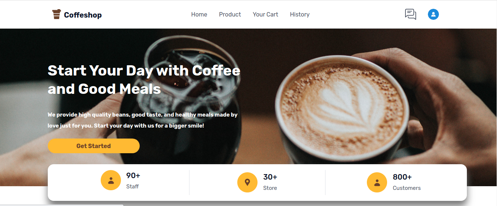

<h1 align="center"><u>Bujank C☕ffee</u></h1>

<h2>Built with</h2>

 

## Table of Contents

-  [Introduction](#introduction)
-  [Features](#features)
-  [Requirements](#requirements)
-  [Usage](#usage-for-development)
-  [Screenshots](#screenshots)
-  [Related Project](#related-project)

## Introduction

<h3>Bujank Coffee is everyone can drinks</h3>

is an Web-Apps for Cafe Shop.

## Features

-  Auth
-  Get Category and Search Product
-  Order feature for customer
-  Payment feature
-  And others

## Requirements

## Usage for development

1. Open your terminal or command prompt.
2. Type `git clone https://github.com/imbasri/bujankcoffee-fe.git`
3. Open folder with your text editor.
4. Start to edit and development.

## Screenshots App

<table border="2">
    

        
        
        
        
        
        
        
        
        
    

</table>

## Related Project

-  Frontend Deploy [`here`](https://bujankcoffee-fe.vercel.app/)
-  Backend API Deploy [`here`](https://bebujankcoffee-1mt7.vercel.app/)
-  Backend API Documentation [`here`](https://documenter.getpostman.com/view/23706970/2s8ZDR75hg)
-  Backend Repository [`here`](https://github.com/imbasri/bebujankcoffee)

<b>&copy;2022❤️BujankCoffee☕</b>

